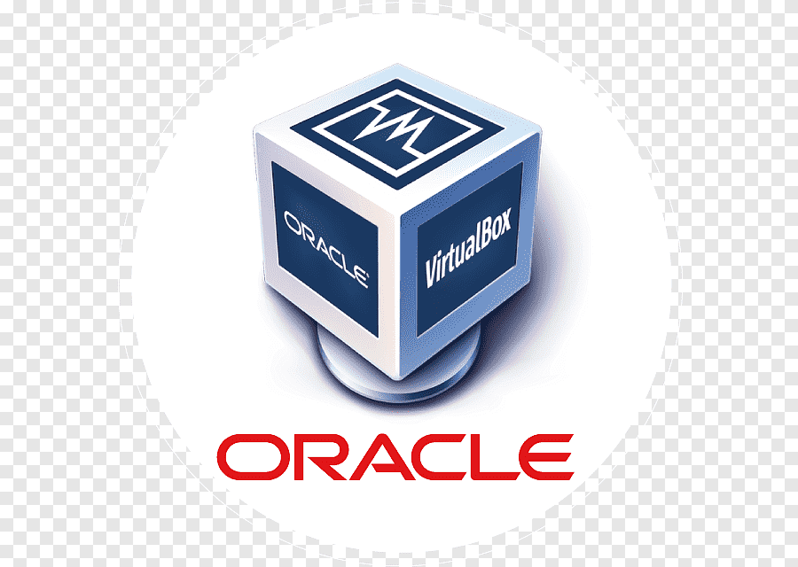
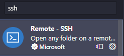
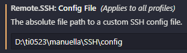

# Preparação de ambiente
### Vamos preparar o ambiente para desenvolvimento de aplicações

#### Neste abiente iremos instalar e configurar os seguintes recursos:
- Maquina virtual (virtual box)
- Distribuição Linux(ubuntu server)
- Nasm
- Compilador da linguagem C
- Configurar o ip entre a maquina real e a virtual
- Configurar via SSH entre VSCode e o ServidorLinux
- Instalar as extensões: material, icon, nasm, SSH e linguagem C/C++

#### Maquina virtual (VirtualBox)



Máquina virtual é uma ferramenta que permite a criação de novos "computadores" e sistemas operacionais, para estudo e trabalho.

Para o nosso estudo iremos utilizar a VirtualBox, da Oracle.
Para instalar basta fazer o download no link a seguir:
<a href="https://www.virtualbox.org/wiki/Downloads" target="_blank"> VirtualBox </a>


##### criando a maquina virtual para o nosso estudo

- configuração:
    > - nome da maquina: servidor
    > - memoria: 4GB(4096)
    > - processador: 2
    > - disco: 100GB
    > - IP e porta do host: 127.0.0.1 e 22
    > - IP e porta do convidado: 10.0.2.15 e 22

- tela inicial de configuração


- tela de configuração do hardware


- tela de configuração do disco


- tela de configuração final


- tela de configuração de rede


- tela de configuração do ip e das portas


#### destribuição ubuntu server

  

para o nosso estudo iremos utilizar uma distribuição linux paraa servidores chamada Ubuntu. Acompanhe o processo de intalação:


faça o download aqui:
<a href="https://ubuntu.com/download/server" target="_blank"> Ubuntu server </a>

- acompanhe a instalação

- tela de inicio da instalação

 

 - seleção de idioma

 

 - seleção de teclado

 

 - tipo de tipo de intalação
 

- configuração de rede
 

- configuração do proxy
 

- pacotes de atualização


- tela de configuração do disco


- configurações finais


- tela configuração do usuario


- tela configuração do ssh


- fim da instalação


#### atualização do sistema

Para correta utilização do servidor Ubuntu que acabamos de instalar, será necessario realizar a atualização do sistema.

Execute o comando a baixo:

```
sudo apt -y && sudo apt uograde -y
```
reinicie seu servidor usando o comando abaixo:

```
reboot
```

#### instalação do compilador NASM
O compilador do NASM é uma ferramenta que nos permite programar em Assembly. Assim é possivel criar programas que manipulam dados que estão nos registradores do processador.

Para instalar o NASM no Ubuntu, usamos o comando:
```
sudo apt install nasm -y
```

#### Instalação do compilador da linguagem C

Em Linux, o compilador da linguagem C é o GCC. Ele é uma ferramenta importante para o desenvolvimento de programas em C.

Para instalar use o comando:
```
sudo apt install gcc-y
```

#### Conexão servidor e VScode via SSH

Precisamos instalar uma estensão no VScode para acessar o nosso servidor de forma remota.



Configuração do acesso remoto:

